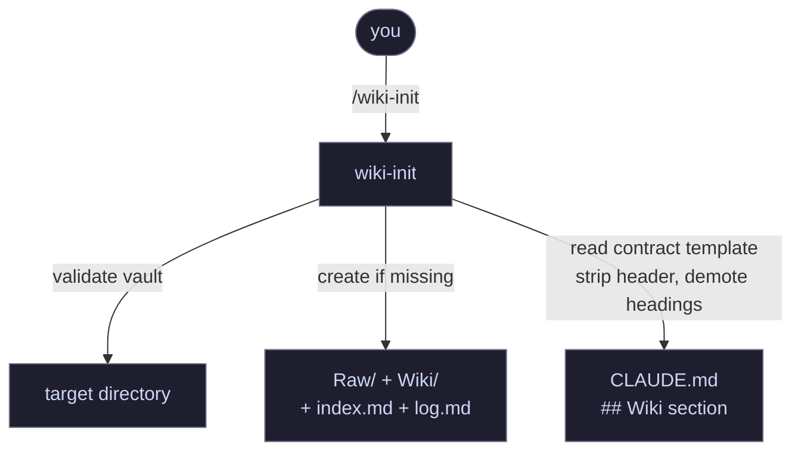
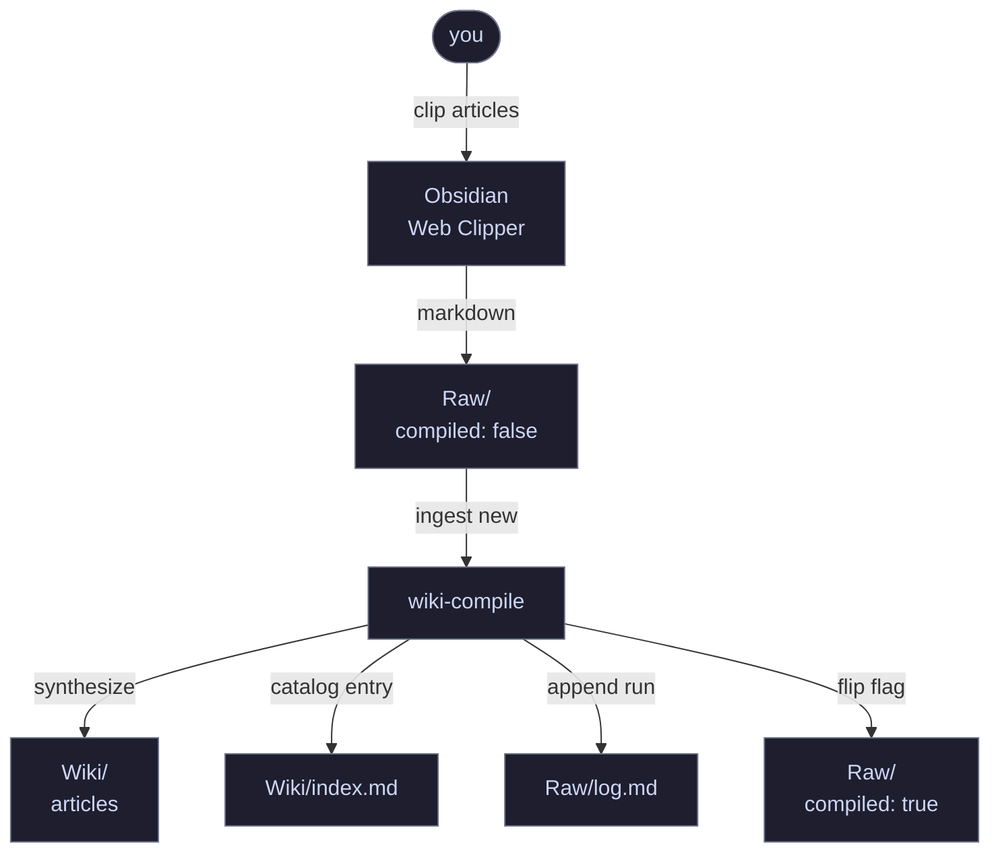
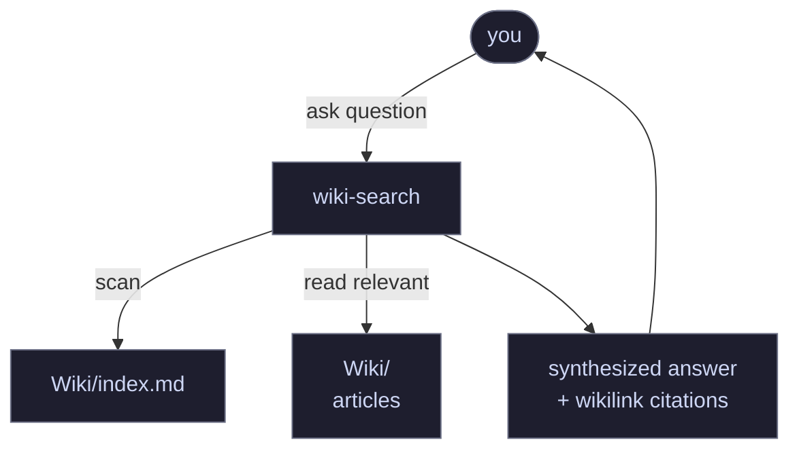
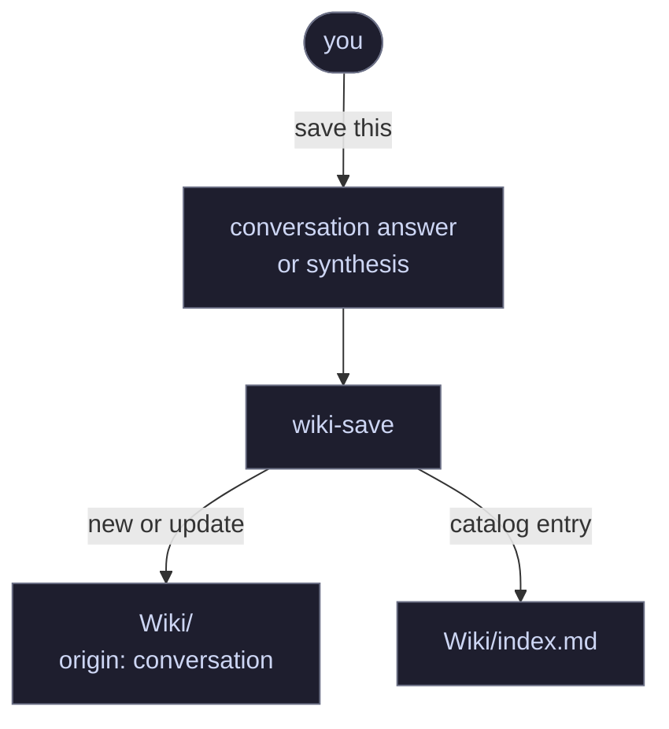
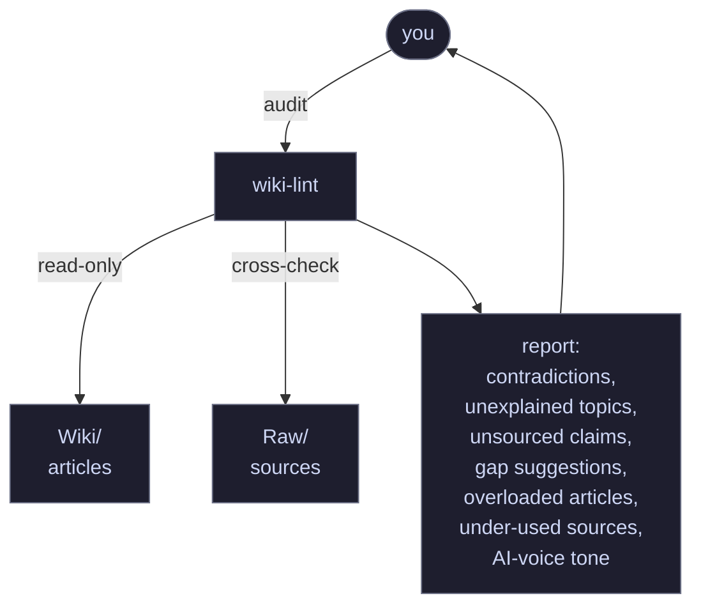

<div align="center">


# llm-wiki-kit

**Your second brain, maintained by Claude.**

A Claude Code plugin that turns an Obsidian vault into an LLM-maintained knowledge base. Five skills: init, compile, search, save, lint.

[](https://github.com/SantiagoBobrik/llm-wiki-kit)
[](https://github.com/SantiagoBobrik/llm-wiki-kit)
[](LICENSE)

</div>

---

<details>
<summary><strong>Table of contents</strong></summary>

- [Prerequisites](#prerequisites)
- [Install](#install)
- [Quick start](#quick-start)
- [How it works](#how-it-works)
- [Skills reference](#skills-reference)
- [Project structure](#project-structure)
- [The contract](#the-contract)
- [Hacks / Pro tips](#hacks--pro-tips)
- [Recommended companion skills](#recommended-companion-skills)
- [Contributing](#contributing)
- [License](#license)

</details>

You clip articles, threads, and notes into `Raw/`. Claude compiles them into structured, interlinked articles in `Wiki/` — grouping related sources, preserving specifics, maintaining cross-references. The knowledge is compiled once and kept current. You curate what goes in; the LLM handles the bookkeeping.

Inspired by:

- **Karpathy** — [original thread](https://x.com/karpathy/status/2039805659525644595) and [full gist](https://gist.github.com/karpathy/442a6bf555914893e9891c11519de94f) describing the LLM knowledge base pattern.
- **Farzaa** — [`personal_wiki_skill.md`](https://gist.github.com/farzaa/c35ac0cfbeb957788650e36aabea836d), a concrete Claude Code skill implementation with strong opinions on tone and anti-cramming.
- **NickSpisak** — [Part 1](https://x.com/NickSpisak_/status/2040448463540830705) and [Part 2](https://x.com/NickSpisak_/status/2041243686265090076) of his second-brain system, arguing for dedicated domain vaults.
- **hooeem** — [tiered course](https://x.com/hooeem/status/2041196025906418094) from zero-skill to full builder setup.

## Prerequisites

### 1. Obsidian + Obsidian CLI

The skills drive Obsidian through the `obsidian` CLI. Install it and make sure Obsidian is running when you invoke them.

```bash
obsidian help
```

Docs: https://obsidian.md/help/cli

### 2. Obsidian Web Clipper

Browser extension that turns web pages into clean markdown files in your vault. This is the ingest path — anything you clip lands in `Raw/` and becomes fuel for `wiki-compile`.

- Chrome / Firefox / Safari: https://obsidian.md/clipper
- Configure the default folder to `Raw/`.

### 3. The `compiled` property in Web Clipper

> [!IMPORTANT]
> Add a `compiled` checkbox property to your Web Clipper template with default value `false`. `wiki-compile` uses `[compiled:false]` to find new clippings, and sets it to `true` after processing.

In Web Clipper settings → template → Properties, add:

| Name | Type | Default |
|---|---|---|
| `compiled` | Checkbox | `false` |

Without this, compile has no way to distinguish new clippings from already-processed ones.

## Install

**Recommended — via plugin marketplace:**

```bash
claude plugin marketplace add SantiagoBobrik/llm-wiki-kit && claude plugin install llm-wiki-kit
```

Skills become available as `/wiki-init`, `/wiki-compile`, `/wiki-search`, `/wiki-save`, `/wiki-lint` (or prefixed `/llm-wiki-kit:wiki-init` if another plugin collides). Run `/reload-plugins` after install if Claude Code was already open.

**From source:**

```bash
mkdir -p ~/.claude/skills
git clone https://github.com/SantiagoBobrik/llm-wiki-kit.git && cp -Rn llm-wiki-kit/skills/* ~/.claude/skills/
```

`cp -n` won't overwrite existing skill folders — if you already have a `wiki-*` skill with the same name, remove it first or copy manually.

## Quick start

1. Run `/wiki-init` — two equivalent options:

   ```
   # Option A — cd into your vault first, then:
   /wiki-init

   # Option B — pass the vault path as an argument (absolute or relative to cwd):
   /wiki-init /absolute/path/to/vault
   /wiki-init ../my-vault
   /wiki-init .
   ```

   `wiki-init` checks the environment, creates `Raw/` and `Wiki/` (with empty `index.md` and `log.md`), and inlines the Wiki contract as a `## Wiki` section inside your `CLAUDE.md` — creating `CLAUDE.md` if it doesn't exist, or appending the section (with headings demoted so they nest properly) if it does. The run is idempotent and never overwrites an existing Wiki section without asking.

   **What gets written into `CLAUDE.md`:** the `## Wiki` section covers folder **structure** (`Raw/`, `Wiki/`, `index.md`, `log.md`), **frontmatter** fields every article must carry, **writing rules** (one concept per article, synthesize don't summarize, preserve specifics, tone), and **linking** conventions. These are the defaults the skills will follow when reading and writing your wiki — and they're fully yours to edit. Don't like a frontmatter tag? Want every article to include a "TL;DR" section? Prefer Spanish headings? Just edit the `## Wiki` section in your `CLAUDE.md` and the skills pick it up on the next run.

2. Start clipping into `Raw/` (via Obsidian Web Clipper or by dropping markdown files), then run `/wiki-compile` to synthesize them into `Wiki/`.

That's it. `/wiki-search`, `/wiki-save`, and `/wiki-lint` are available alongside compile.

> [!IMPORTANT]
> `wiki-init` operates on Obsidian vaults registered with the Obsidian CLI. If you run it from a directory that isn't a known vault, the skill lists your vaults and asks you to pick one.

## How it works

**Three layers:**

- **Raw/** — immutable source clippings. The LLM reads but never modifies.
- **Wiki/** — LLM-owned articles. Synthesized, interlinked, compounding over time.
- **The contract** — structure, frontmatter, writing rules, tone. Lives as a `## Wiki` section inside the target's `CLAUDE.md`, inlined by `wiki-init` from the skill's shipped template. Claude Code reads `CLAUDE.md` as standard project context, so the contract loads automatically.

**Five operations:**

| Skill | What it does |
|---|---|
| **init** | One-shot bootstrap: create `Raw/` + `Wiki/`, inline the contract into `CLAUDE.md` |
| **compile** | Ingest new clippings, group by topic, merge into existing articles or create new ones |
| **search** | Ask questions, get a synthesized answer drawn from the wiki with wikilink citations |
| **save** | File a good conversation answer back into the wiki so it doesn't disappear |
| **lint** | Periodic audit for contradictions, unsourced claims, gaps, under-used sources, AI-voice tone |

### Bootstrap: init



### Ingest: clip → compile



### Query: search



### Save: conversation → wiki



### Audit: lint



## Skills reference

### A note on pre-loaded context

Before each skill runs, it checks which Obsidian vaults you have open so it knows where to work. That's it — a single command:

```bash
obsidian vaults verbose
```

Nothing else is executed automatically. The skill body then decides what to read (index, clippings, etc.) based on the vault you picked. If you fork a skill and want to see or change what gets pre-loaded, it's the line starting with `!` at the top of each `SKILL.md`.

### wiki-init

Bootstraps an Obsidian vault into a wiki-enabled workspace. Creates the folder structure and inlines the Wiki contract as a `## Wiki` section inside the target's `CLAUDE.md`, sourced from the skill's own `assets/contract-template.md`.

**Pre-loads:** the full output of `obsidian vault list` so step 1 can validate the target.

- **Vault-only.** Step 1 matches the target against the Obsidian CLI's vault list. On a match it proceeds; otherwise it lists the available vaults and asks the user (via `AskUserQuestion`) which one to bootstrap.
- **Idempotent.** Running it twice never overwrites anything silently.
- **Header demotion on inline.** When merging the contract into `CLAUDE.md`, the top-level `# Wiki` title is stripped and every remaining heading is demoted one level (`##` → `###`, `###` → `####`, …), so the whole contract nests cleanly under `## Wiki` instead of colliding with existing sections at the same level.
- **Safe append.** If `CLAUDE.md` already has a `## Wiki` section, the skill does not touch it — it shows a diff and asks whether to replace, skip, or write the shipped version as `CLAUDE.md.wiki.new` for manual merge.
- Does not install sibling skills and does not seed any sample content.

**Arguments:**

- `[target-dir]` *(positional, optional)* — directory to bootstrap. Must be an Obsidian vault. Defaults to cwd; if cwd isn't a registered vault, the skill prompts you to pick one.

Invoke: `/wiki-init`, `/wiki-init .`, or `/wiki-init /path/to/vault`.

### wiki-compile

Reads uncompiled clippings from `Raw/`, groups them by topic, and writes synthesized articles into `Wiki/`.

**Pre-loads:** available vaults, uncompiled clippings (`obsidian search query='[compiled:false]' path="Raw"`), and the current `Wiki/index.md` for duplicate detection.

- Detects new clippings via `compiled: false` frontmatter.
- Groups by topic affinity — 3 clippings about the same concept become 1 article, not 3.
- Checks `Wiki/index.md` for existing articles before creating new ones. Enriches instead of duplicating.
- Runs a close-check before saving: are the named people, numbers, examples, and tensions from the sources present in the article?
- Updates `Wiki/index.md` and appends a timestamped entry to `Raw/log.md`.
- Marks each processed clipping as `compiled: true`.

**Arguments:**

- `--vault <name>` *(optional)* — target vault. Use `--vault .` for the vault matching cwd. If omitted and you have multiple vaults, the skill asks.
- `[topic or filename]` *(positional, optional)* — fuzzy scope for the compile run; matches against title, tags, or body. Omit to compile **every** uncompiled clipping.

Invoke: `/wiki-compile`, `/wiki-compile --vault my-vault`, `/wiki-compile llm knowledge bases`, or "compile my raws".

### wiki-lint

Read-only audit of the entire `Wiki/` tree.

**Pre-loads:** available vaults, `Wiki/index.md`, and full `find` listings of both `Wiki/` and `Raw/` so the audit can cross-reference articles against their sources without extra tool calls.

Reports:

1. **Contradictions** between articles.
2. **Unexplained topics** — concepts referenced but never defined.
3. **Unsourced claims** — factual statements without a source backing.
4. **Gap suggestions** — 3 articles that would fill obvious holes.
5. **Overloaded articles** — candidates to split (two unrelated concepts under one title).
6. **Under-used sources** — articles whose sources contain names, numbers, or examples that never made it into the body.
7. **AI-voice tone** — grep for hype adjectives, editorial voice, progressive narrative, decorative em dashes.

Never modifies files. Suggests, doesn't edit.

**Arguments:**

- `--vault <name>` *(optional)* — target vault. Use `--vault .` for the vault matching cwd. If omitted and you have multiple vaults, the skill asks.
- No positional arguments — lint always runs over the whole `Wiki/` tree.

Invoke: `/wiki-lint`, `/wiki-lint --vault my-vault`, or "lint my wiki".

### wiki-save

Takes a conversation answer or synthesis and files it as a Wiki article. For closing the query loop — good answers become part of the wiki instead of disappearing into chat history.

**Pre-loads:** available vaults and `Wiki/index.md` to decide whether to update an existing article or create a new one.

- Detects whether a related article exists (update) or not (create new).
- Tags frontmatter with `origin: conversation` so it's distinguishable from Raw-compiled articles.
- Synthesizes into a clean standalone article, not a Q&A transcript.

**Arguments:**

- `--vault <name>` *(optional)* — target vault. Use `--vault .` for the vault matching cwd. If omitted and you have multiple vaults, the skill asks.
- `[topic or title]` *(positional, optional)* — article title/topic hint. Omit to let the skill infer it from recent conversation context.

Invoke: `/wiki-save`, `/wiki-save <topic>`, `/wiki-save --vault <name> <topic>`, or "save this to wiki".

### wiki-search

Queries the wiki and returns a synthesized answer with citations.

**Pre-loads:** available vaults and `Wiki/index.md` so Claude can scan the catalog before drilling into individual articles.

- Reads `Wiki/index.md` first to find relevant articles.
- Drills into the articles themselves for detail.
- Answers as a single voice with wikilinks to every article cited.

**Arguments:**

- `--vault <name>` *(optional)* — target vault. Use `--vault .` for the vault matching cwd. If omitted and you have multiple vaults, the skill asks.
- `<query>` *(positional, optional)* — topic, term, or question. Omit to let the skill infer from conversation context.

Invoke: `/wiki-search mcp`, `/wiki-search --vault my-vault claude plugins`, or "what do I have on X".

## Project structure

```
llm-wiki-kit/
├── .claude-plugin/
│   ├── plugin.json              ← plugin manifest
│   └── marketplace.json         ← marketplace distribution config
├── skills/
│   ├── wiki-init/
│   │   ├── SKILL.md
│   │   └── assets/
│   │       └── contract-template.md  ← canonical contract template
│   ├── wiki-compile/
│   │   ├── SKILL.md
│   │   └── assets/
│   │       ├── article-template.md
│   │       ├── index-entry-template.md
│   │       └── log-entry-template.md
│   ├── wiki-lint/
│   │   └── SKILL.md
│   ├── wiki-save/
│   │   └── SKILL.md
│   └── wiki-search/
│       └── SKILL.md
├── CLAUDE.md
└── README.md
```

## The contract

The canonical contract template lives in [`skills/wiki-init/assets/contract-template.md`](skills/wiki-init/assets/contract-template.md). `wiki-init` inlines it into each target's `CLAUDE.md` as a `## Wiki` section at bootstrap time, demoting headings so the structure nests cleanly. The operational skills then read the target's `CLAUDE.md` for the rules, the same file Claude Code loads as standard project context.

The contract covers:

- **Structure**: `Raw/`, `Wiki/`, `Wiki/index.md`, `Raw/log.md`.
- **Frontmatter**: required fields, type list.
- **Writing rules**: one article = one concept (the "and" test), synthesize don't summarize, preserve specifics, tone (read not sold), linking.

To change the defaults for every new workspace, edit `skills/wiki-init/assets/contract-template.md` before distributing the pack. To change the rules for an existing workspace, edit the `## Wiki` section inside that workspace's `CLAUDE.md` — the skills read whatever the local `CLAUDE.md` says.

## Hacks / Pro tips

- **Download attachments for current file** — Obsidian's built-in command (command palette) pulls remote images and assets referenced by a clipping into the vault, so the `Raw/` note becomes self-contained and survives if the original page goes down. Run it on fresh clippings before compiling if you want them archive-safe.
- **Web Clipper auto-fetches transcripts** — when you clip a YouTube (or similar) video page, the Obsidian Web Clipper pulls the transcript and lands it as a ready-to-read article in `Raw/`. No manual copy-paste from YouTube — just clip the video URL and the transcript is already there for `wiki-compile` to ingest.

## Recommended companion skills

These skills from [kepano/obsidian-skills](https://github.com/kepano/obsidian-skills) pair well with llm-wiki-kit — they give Claude deeper Obsidian integration:

```bash
npx skills add https://github.com/kepano/obsidian-skills --skill obsidian-cli
npx skills add https://github.com/kepano/obsidian-skills --skill obsidian-markdown
npx skills add https://github.com/kepano/obsidian-skills --skill obsidian-bases
```

| Skill | Why it helps |
|---|---|
| **obsidian-cli** | CLI commands for vault management — the same CLI llm-wiki-kit drives under the hood |
| **obsidian-markdown** | Obsidian-flavored markdown: wikilinks, callouts, embeds, properties |
| **obsidian-bases** | Database-like views over your notes with filters, formulas, and summaries |

## Contributing

Contributions welcome! See [CONTRIBUTING.md](CONTRIBUTING.md) for guidelines.

## License

[MIT](LICENSE)
